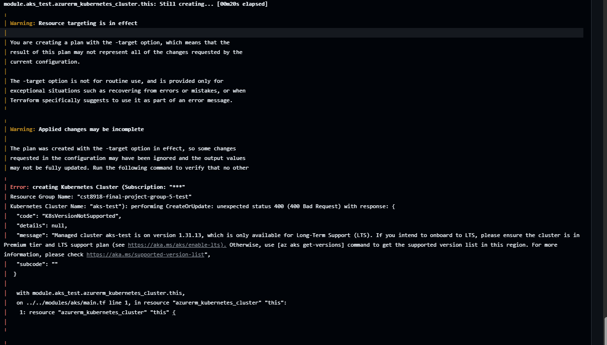
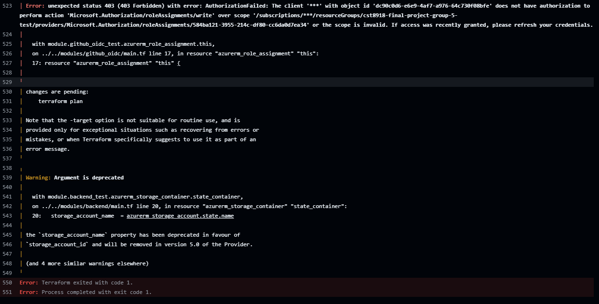

# CST 8918 Final Project: Terraform, Azure AKS, and GitHub Actions

## Team

| Name | GitHub Profile Link |
| :--- | :--- |
| Kylath Mamman George | <https://github.com/KylathGeorge> |
| Nsengiyumva Kelvin Ngabo | <https://github.com/ngab0016> |
| Rutayisire Muhire | <https://github.com/Muhire-Josue> |
| Aryan Rudani | <https://github.com/ruda0008> |

This project uses Terraform to provision Azure infrastructure for the Remix Weather Application. It includes reusable Terraform modules, separate environments for test and production, and GitHub Actions integration using Azure federated identity. The goal is to manage infrastructure in a clean and repeatable way while supporting team collaboration and CI/CD.

## Terraform Apply Failure Notes:

While implementing the terraform apply workflow, we keep encountering this issue:





We tried different solutions as can be seen in our github actions screenshot.

## Project Structure

```text
terraform/
  modules/
    aks/
      main.tf
      variables.tf
      outputs.tf
    github_oidc/
      main.tf
      variables.tf
      outputs.tf
  environments/
    test/
      main.tf
      variables.tf
      terraform.tfvars
    prod/
      main.tf
      variables.tf
      terraform.tfvars
```

## Included in This Setup

- Reusable AKS Terraform module
- Test AKS environment
  - 1 node
  - Standard_B2s
  - Kubernetes 1.32
- Production AKS environment
  - autoscaling from 1 to 3 nodes
  - Standard_B2s
  - Kubernetes 1.32
- GitHub Actions OIDC / federated identity setup for Azure login

## Prerequisites

Before using this project, make sure the following are installed and available:

- Terraform
- Azure CLI
- Git
- A GitHub account
- Access to an Azure subscription
- Permission to create:
  - Resource groups
  - AKS clusters
  - User-assigned managed identities
  - Federated identity credentials
  - Role assignments

You should also be logged into Azure locally:

```bash
az login
az account set --subscription "<your-subscription-id>"
```

## Placeholders That Must Be Replaced

The current Terraform files contain placeholder values. These must be replaced with real values before deployment.

### In `terraform/environments/test/terraform.tfvars`

Replace:

- `REPLACE_WITH_RESOURCE_GROUP_NAME`
- `REPLACE_WITH_TEST_SUBNET_ID`

### In `terraform/environments/prod/terraform.tfvars`

Replace:

- `REPLACE_WITH_RESOURCE_GROUP_NAME`
- `REPLACE_WITH_PROD_SUBNET_ID`

### In `terraform/environments/test/main.tf`

Replace in the GitHub OIDC subject:

- `REPLACE_WITH_GITHUB_OWNER`
- `REPLACE_WITH_REPO_NAME`

Current pattern:

```text
repo:REPLACE_WITH_GITHUB_OWNER/REPLACE_WITH_REPO_NAME:pull_request
```

### In `terraform/environments/prod/main.tf`

Replace in the GitHub OIDC subject:

- `REPLACE_WITH_GITHUB_OWNER`
- `REPLACE_WITH_REPO_NAME`

Current pattern:

```text
repo:REPLACE_WITH_GITHUB_OWNER/REPLACE_WITH_REPO_NAME:ref:refs/heads/main
```

## Required Real Values

Before this setup can work fully, your team needs to know these values:

- Azure resource group name
- Azure region
- Test subnet ID
- Production subnet ID
- GitHub owner name
- GitHub repository name
- Azure subscription ID

## Setup Steps

### 1. Clone the Repository

```bash
git clone <repo-url>
cd <repo-name>
```

### 2. Review the Terraform Structure

The reusable AKS module is located in:

```text
terraform/modules/aks
```

The reusable GitHub OIDC module is located in:

```text
terraform/modules/github_oidc
```

The environment-specific Terraform code is located in:

```text
terraform/environments/test
terraform/environments/prod
```

### 3. Replace Placeholder Values

Open and update these files:

- `terraform/environments/test/terraform.tfvars`
- `terraform/environments/prod/terraform.tfvars`
- `terraform/environments/test/main.tf`
- `terraform/environments/prod/main.tf`

Replace all placeholder values with the real project values provided by your team.

### 4. Initialize Terraform

For test:

```bash
terraform -chdir=terraform/environments/test init
```

For prod:

```bash
terraform -chdir=terraform/environments/prod init
```

### 5. Validate the Configuration

For test:

```bash
terraform -chdir=terraform/environments/test validate
```

For prod:

```bash
terraform -chdir=terraform/environments/prod validate
```

### 6. Format Terraform Files

```bash
terraform fmt -recursive terraform
```

### 7. Review the Execution Plan

For test:

```bash
terraform -chdir=terraform/environments/test plan
```

For prod:

```bash
terraform -chdir=terraform/environments/prod plan
```

### 8. Apply the Infrastructure

For test:

```bash
terraform -chdir=terraform/environments/test apply
```

For prod:

```bash
terraform -chdir=terraform/environments/prod apply
```

## GitHub Actions Authentication

This project uses Azure federated identity for GitHub Actions. This means GitHub Actions can authenticate to Azure without storing a client secret.

Two identities are defined:

- one for pull request workflows in the test environment
- one for main branch workflows in the production environment

After deployment, collect the output values and configure them as GitHub repository secrets:

- `AZURE_CLIENT_ID`
- `AZURE_TENANT_ID`
- `AZURE_SUBSCRIPTION_ID`

These values are required for GitHub Actions to log in to Azure.

A typical workflow will also need:

```yaml
permissions:
  id-token: write
  contents: read
```

And Azure login will look like this:

```yaml
- uses: azure/login@v2
  with:
    client-id: ${{ secrets.AZURE_CLIENT_ID }}
    tenant-id: ${{ secrets.AZURE_TENANT_ID }}
    subscription-id: ${{ secrets.AZURE_SUBSCRIPTION_ID }}
```

## Team Notes

- Kylath was expected to provide the base network resources and subnet IDs
- Muhire provides the AKS and GitHub OIDC modules
- Aryan handles the application infrastructure
- Kelvin uses the Azure identity outputs inside GitHub Actions workflows

Because this is a team project, each member should work from a feature branch and open a pull request to `main`.

## Quick Validation Commands

```bash
terraform fmt -recursive terraform
terraform -chdir=terraform/environments/test init
terraform -chdir=terraform/environments/test validate
terraform -chdir=terraform/environments/prod init
terraform -chdir=terraform/environments/prod validate
```

## Clean Up

After testing and submission, delete all Azure resources created for this project to avoid unnecessary charges.

To destroy the infrastructure with Terraform, run:

```bash
terraform -chdir=terraform/environments/test destroy
terraform -chdir=terraform/environments/prod destroy
```

If you want to review what will be deleted before destroying, run:

```bash
terraform -chdir=terraform/environments/test plan -destroy
terraform -chdir=terraform/environments/prod plan -destroy
```
